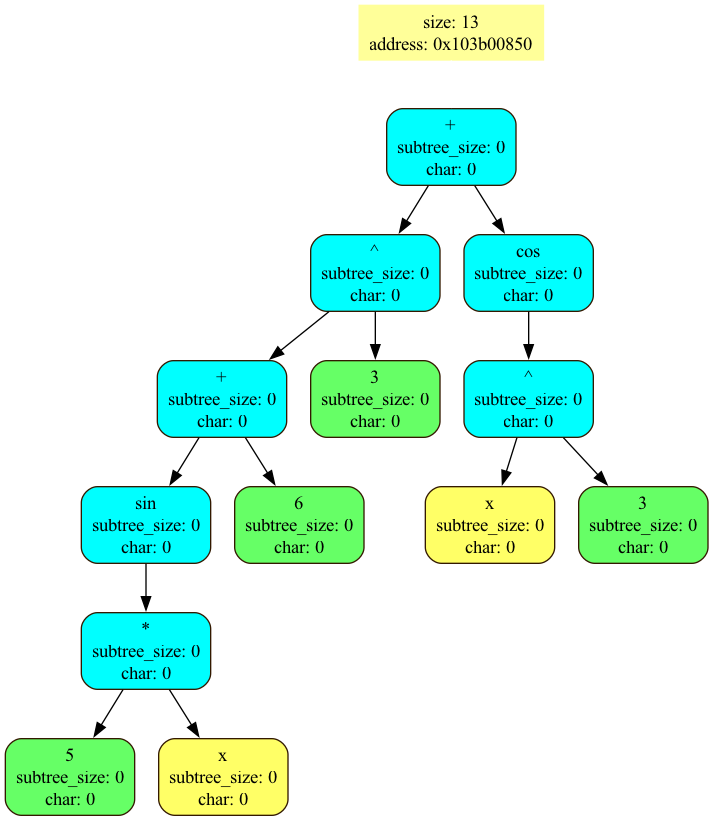
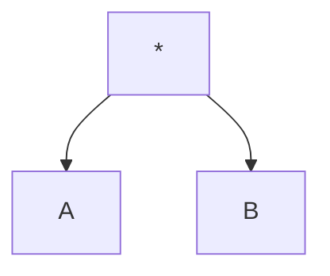

# Дифференциатор

### Принцип действия

Программа принимает на вход файл, в котором записано математическое выражение. При помощи алгоритма парсинга строки выражение преобразуется в бинарное дерево, с которым в дальнейшем работает программа.

**Поддерживаемые операции**: `+`, `-`, `*`, `/`, `sin`, `cos`, `ln`.

## Функции

### Создание дерева

При указании опции `--graph` при помощи утилиты `graphviz` будет создано изображение с бинарным деревом.  
Пример:
<figure>

</figure>

### Вычисление выражения

При указании опции `--calc` программа найдет вычислит значение введенного выражения. Если при расчете встречаются переменные, программа попросит ввести их значения.

### Дифференцирование

При указании опции `--latex` построенное бинарное дерево будет пребразовано про правилам дифференцирования.

[Пример](DED.pdf) полученного файла.