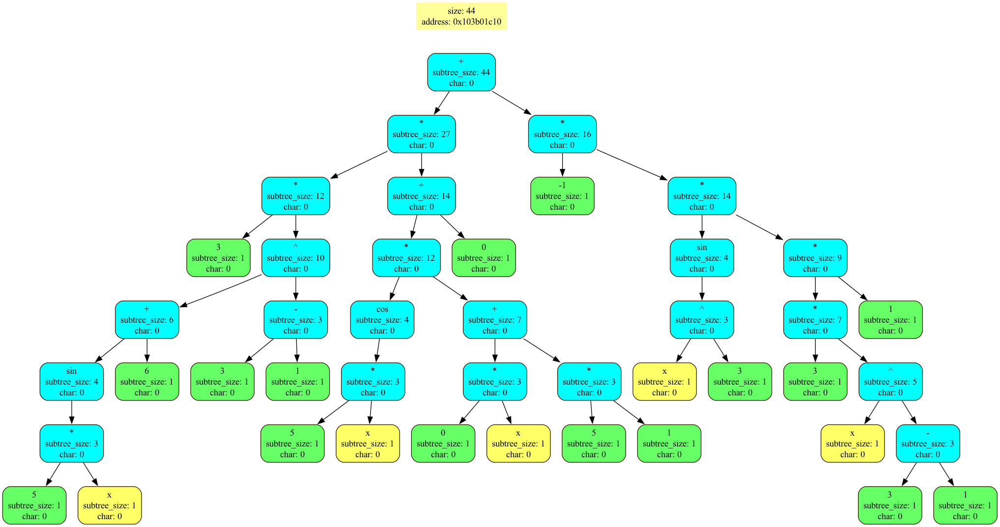
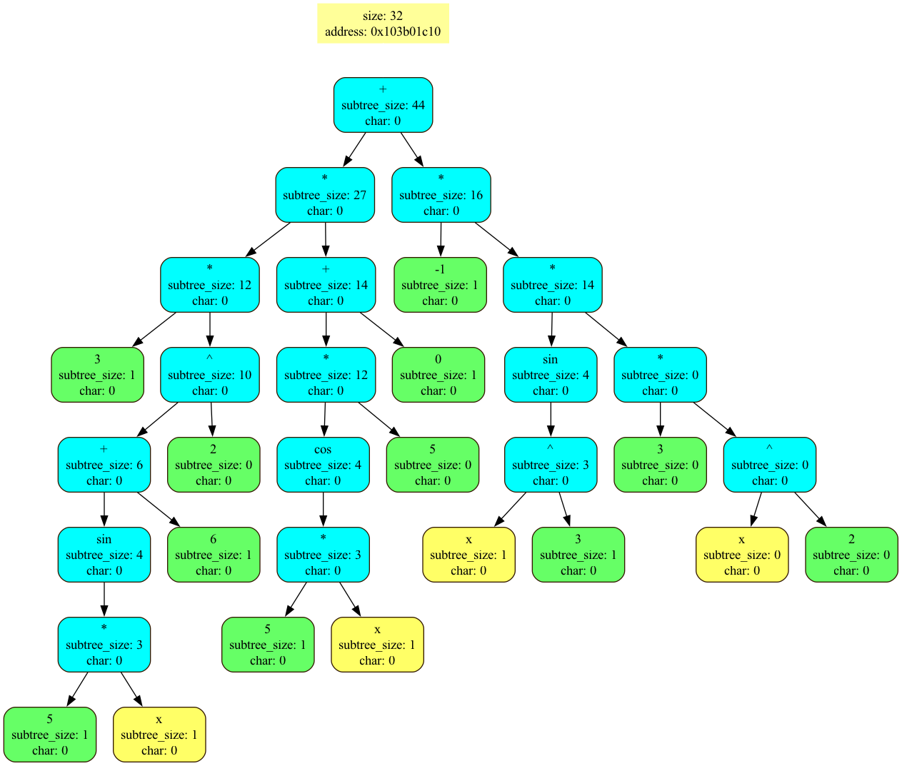

# Дифференциатор

Программа считывает из файла  `expression.txt` математическое выражение. При помощи алгоритма парсинга строки выражение преобразуется в бинарное дерево, с которым в дальнейшем работает программа.

**Поддерживаемые операции**: `+`, `-`, `*`, `/`, `sin`, `cos`, `ln`.

## Функции

### Создание графика

При указании опции `--graph` программа проверит, что введенное выражение зависит от одной переменной. Если это так, то будут рассчитаны точки для построения графика функции в формате `(x, y)`. Результат будет записан в файл `plоt_file.txt`.

### Вычисление выражения

При указании опции `--calc` программа найдет вычислит значение введенного выражения. Если при расчете встречаются переменные, программа просит ввести их значения.

### Дифференцирование

При указании опции `--latex` построенное бинарное дерево будет преобразовано про правилам дифференцирования.

1) **Введенное выражение**
    <figure>
    
    </figure>

2) **Производная**
    <figure>
    
    </figure>

3)  **Производная после упрощения**
    <figure>
    
    </figure>

[Пример](DED.pdf) полученного файла.